### 윈도우에서 git을 clone받는 방법
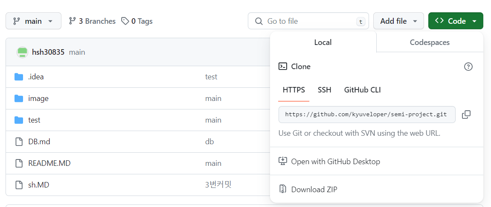 
Download.ZIP을 눌러서 원하는 폴더에 압축을 푸는 방식과 
링크를 복사해서 원하는 폴더에서 cmd를 실행시켜  
git clone 링크 를 입력하면 받아진다 
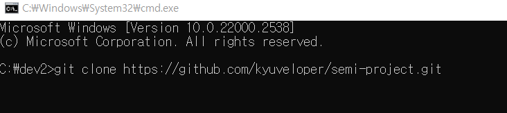 
### main에서 작업하지 않고 각자의 branch에서 작업하고 합치는 이유
여러명에서 main에서 동시에 작업을 하다가
누군가 commit을 해버리면 그사람과 다른 사람들의 버전이 달라져서
에러가 발생한다. 
이 경우에 강제로 합쳐주는 git stash를 사용한다 
때문에 각자의 branch에서 따로 작업을 한 다음에 main에 합쳐
버전이 달라지는걸 방지해준다  
### commit을 자주하는 이유
A,B,C,D라는 각자 branch와 main이 존재할때 
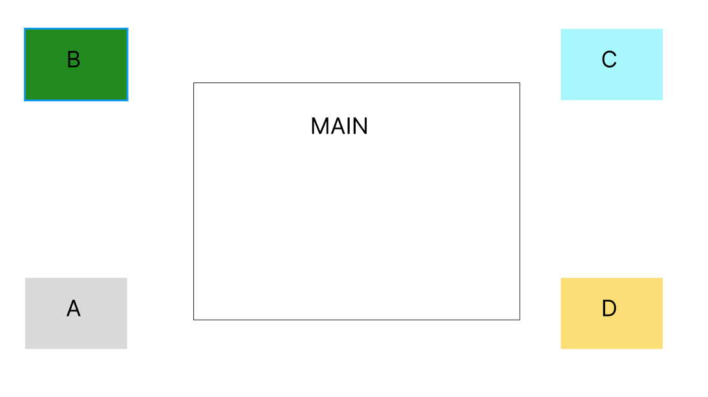 
commit을 거의 안해 많은 작업량을 올린 경우 
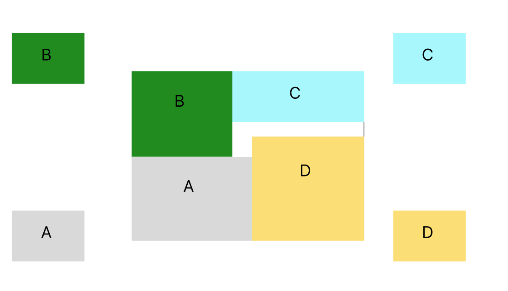 
commit을 자주 해서 적은 작업량을 올린 경우 
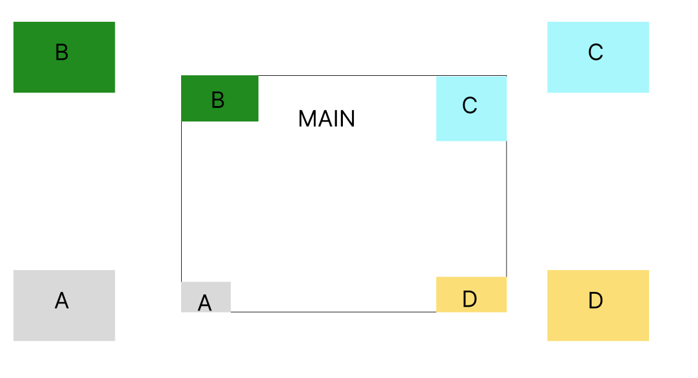 
둘 다 오류가 발생할 경우 수정하기 쉬운건 commit을 자주 한 경우다 
그래서 commit에 대한 시간을 정하고 설명을 적어준다 
### 개인 branch 생성 - 이동 - 커밋
1. git branch (branch 이름) : 입력한 이름의 branch 생성
2. git branch : 내가 어느 branch에 있는지 어떤 branch가 있는지 확인 용도
3. git checkout (branch 이름) : 입력한 이름의 branch로 이동  주의 사항: 작업하고 있던 것을 commit 하지 않으면 이동이 불가능함
4. 작업물을 어느정도 만든후
5. git add .
6. git commit -m "이름"
7. git push origin (branch 이름)
### main branch와 다른 branch의 병합 방법
1. git checkout main : main에 병합할 것이니 main으로 이동
2. git merge (branch 이름) : 입력한 이름의 branch를 main에 병합  git merge 는 병합 main에서 git push해야됨
3. git branch --merged : 병합이 됐는지 확인
### main에서의 데이터 받는 방법
git pull 또는 git pull origin main
### commit 확인, 취소, 다시 불러오기
#### log 확인방법
git log : log를 확인한다. 종료 Q   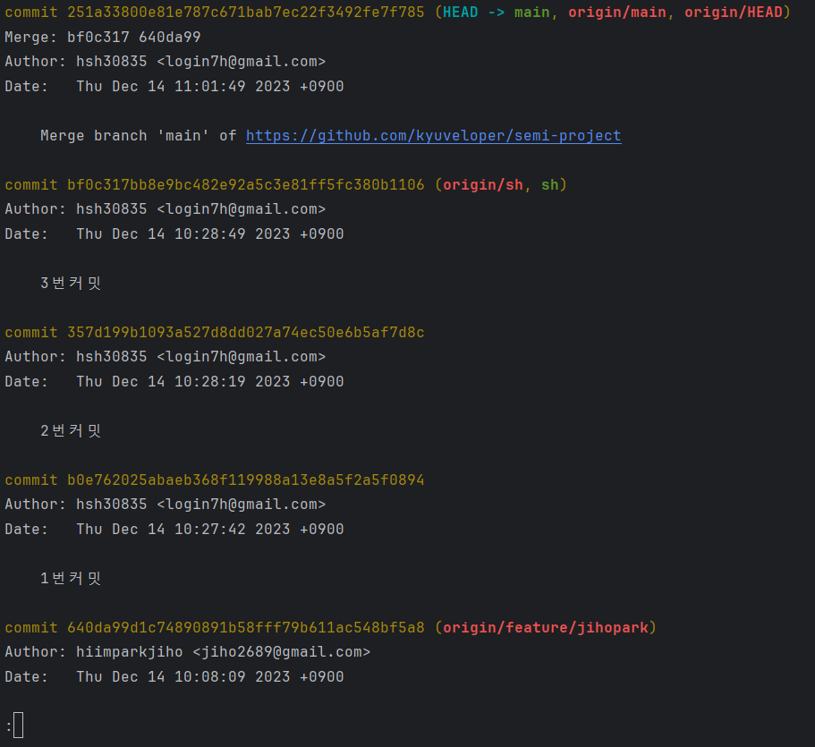 
commit 오른쪽의 데이터가 로그임 하지만 이름이 너무 긴 문제가 있다 
3번커밋의 log이름은 bf0c317bb8e9bc482e92a5c3e81ff5fc380b1106
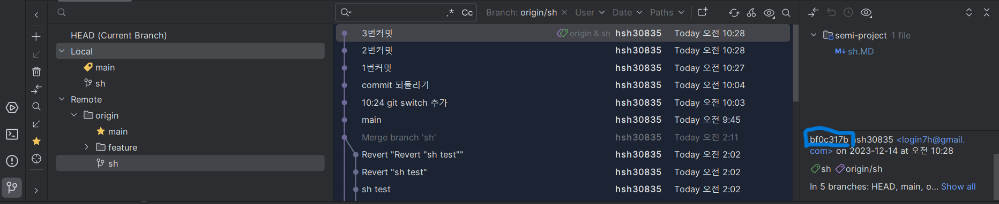
git을 누르고 오른쪽 하단을 보면 log의 이름이 간소화되서 나온다  
간소화된 3번커밋의 이름은 bf0c317b  
#### commit 취소 및 불러오기 방법
git revert 로그이름 : 로그이름을 취소한다  
git reset --hard 로그이름 : 취소한 로그이름을 다시 불러온다 
#### 예시
1. sh.MD에 있는 현재 상황 
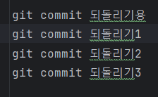 
2. git revert bf0c317b 입력 
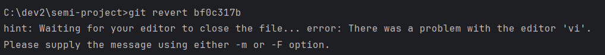 
3. git revert bf0c317b 입력 후 결과 
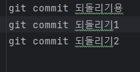 
4. git rest --hard bf0c317b 입력 
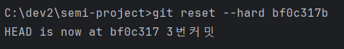 
5. git rest --hard bf0c317b 입력 후 결과 
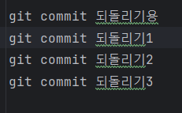 
git revert bf0c317b을 입력하면 git commit 되돌리기3이 취소된걸 확인 할 수 있다 
git rest --hard bf0c317b를 입력하면 취소됐던 git commit 되돌리기3 을 다시 불러왔다
### !주의사항!
commit 한 순서대로 취소를 해야됨 안그러면 충돌남 
 
ex)3번커밋이 존재하는 상태에서 2번 커밋을 취소하려고 시도하기
1. git revert 357d199b을 실행시 (357d199b은 2번커밋)  
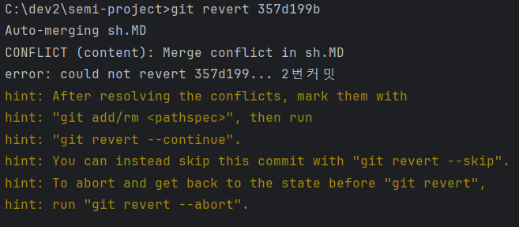 
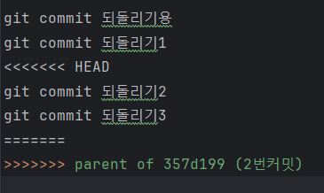 
화면과 같이 충돌이 발생함 
충돌 해결을 반드시 먼저 해줘야됨 
2-1. git reset --hard 357d199b 입력시 
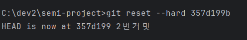 
2-2. 2번커밋까지 돌아온 걸 확인 할 수 있다. 
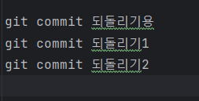 
3-1. git reset --hard bf0c317b를 실행시 
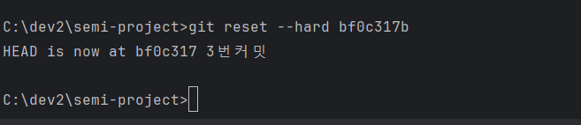 
3-2. 3번커밋까지 돌아온 걸 확인 할 수 있다. 
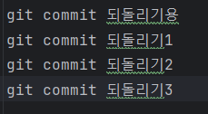 
